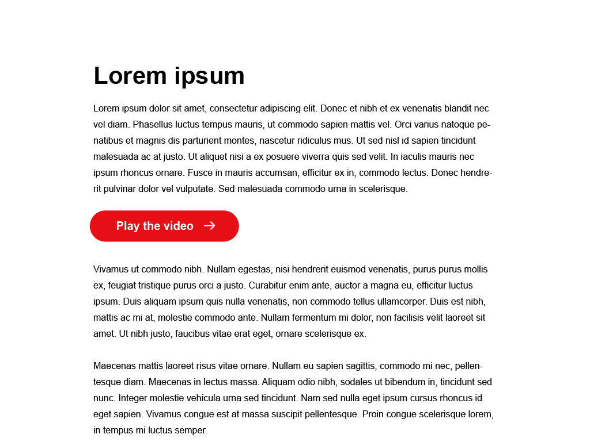
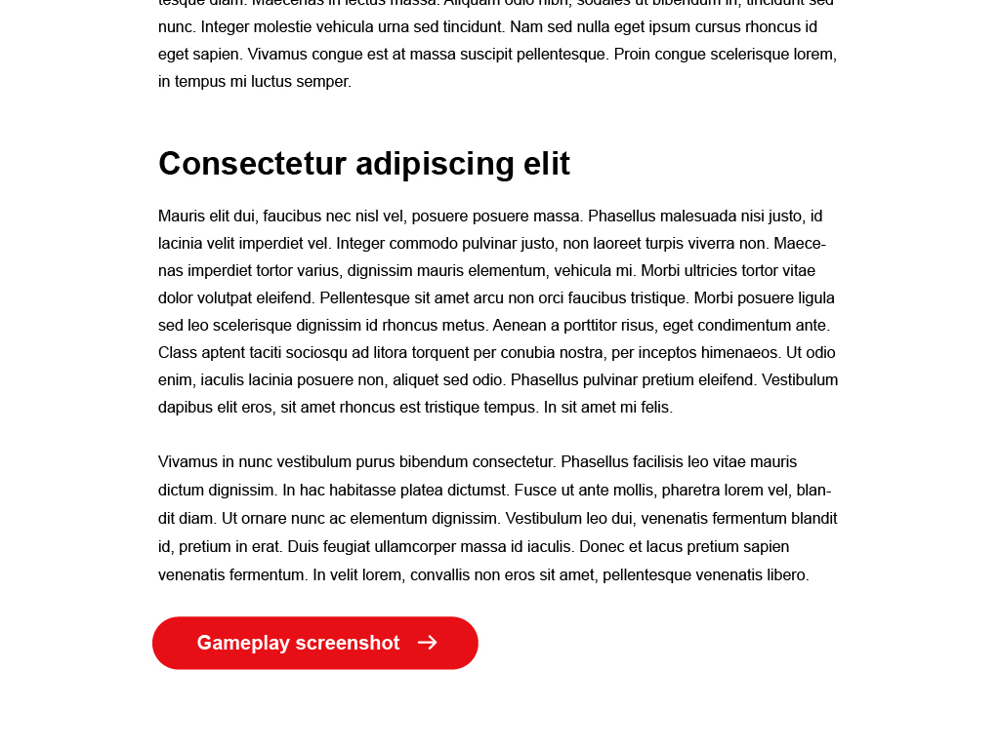
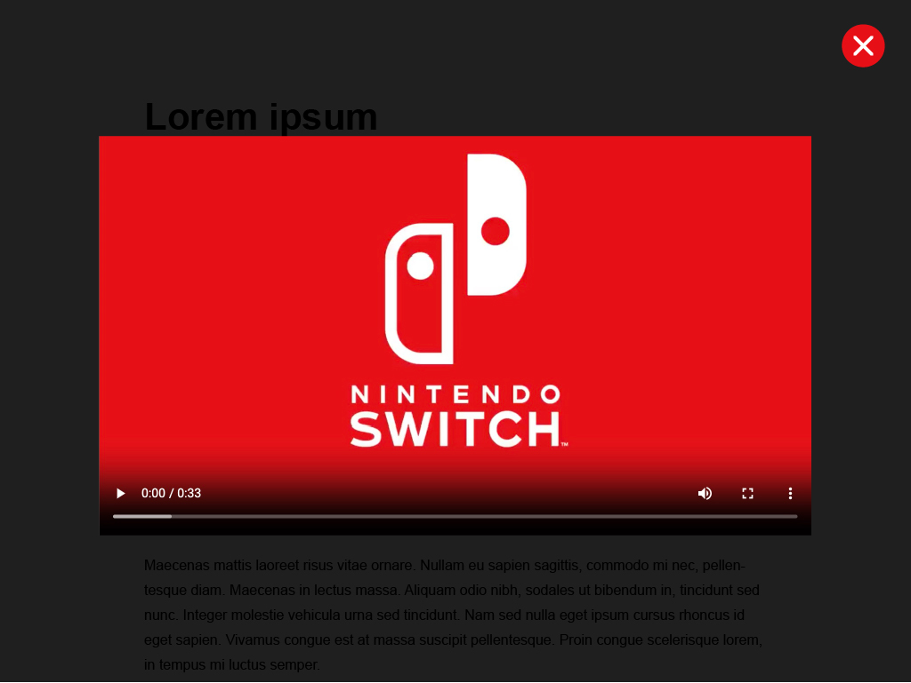
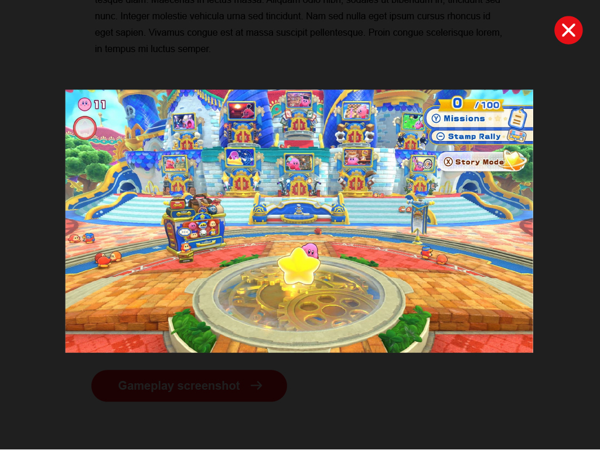

# Technical interview

## The ask

Create a modal window that can be opened by the clicking/tapping on the corresponding UI elements. The modal should support both video and image content, depending on which element was clicked. See the [visual reference](#visual-reference) section below. All placeholder text content and basic text styles are provided for you already, with the exception of the call-to-action elements. Consider the following as you work through this:

- responsiveness;
- when the modal is open, the document should not be scrollable;
- the video should automatically play when the video modal opens;
- animation - where appropriate, elements should contain interaction animations or transitions;
- accessibility - consider the keyboard user's experience, as well as any potential screen-reader/assistive-technology concerns;

## The limitations

The purpose of this task is to test your problem-solving approach, your ability to compartmentalize development tasks, and your ability to jump in and work with minimal details. The task is to be undertaken over the course of an hour. It's ok not to finish, just try to get into as much detail as you can in that time.

## Visual reference

### Page content:

  
  
---

### Page content, continued:

---

### Modal: video content:

---

### Modal: image content:

