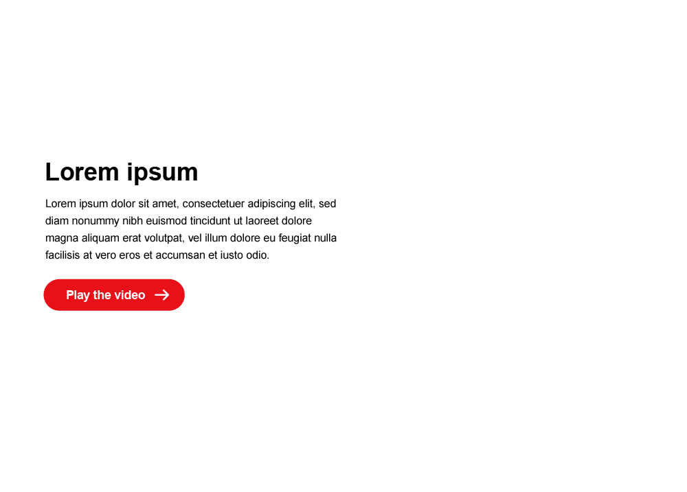
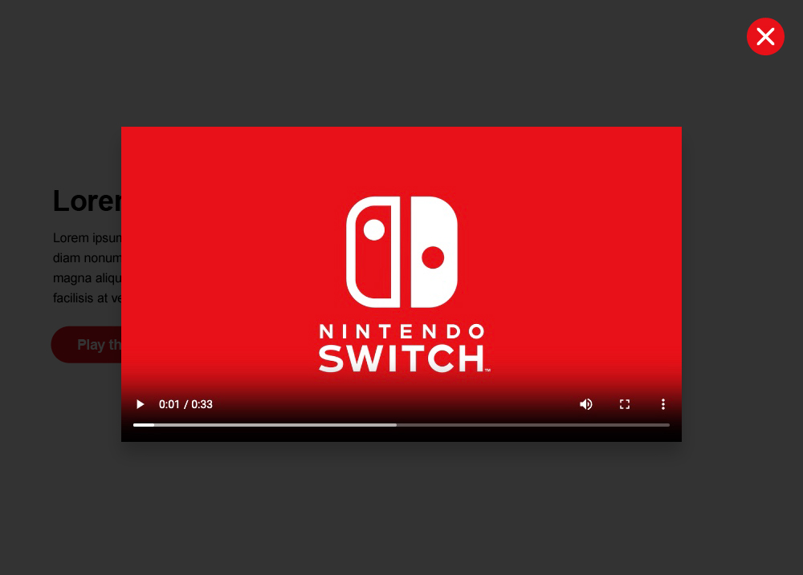

# Technical interview

## The ask

Create a responsive modal window that contains a video and a close button, and is triggered by a click/tap interaction on the UI element. See `mockup-1.jpg` and `mockup-2.jpg` in the root of the project for a reference. It should include the following:

- responsive;
- video - the video should automatically play when the modal opens;
- animation - where appropriate, the UI elements should contain interaction animations/transitions;
- accessibility - consider the keyboard user's experience, as well as any potential screen-reader concerns;

## The limitations

The purpose of this task is to test your problem-solving approach, your ability to compartmentalize development tasks, and your ability to jump in and work with minimal details. The task is to be undertaken over the course of an hour. It's ok not to finish, just try to get into as much detail as you can in that time.

## Visual reference

  
  
  

